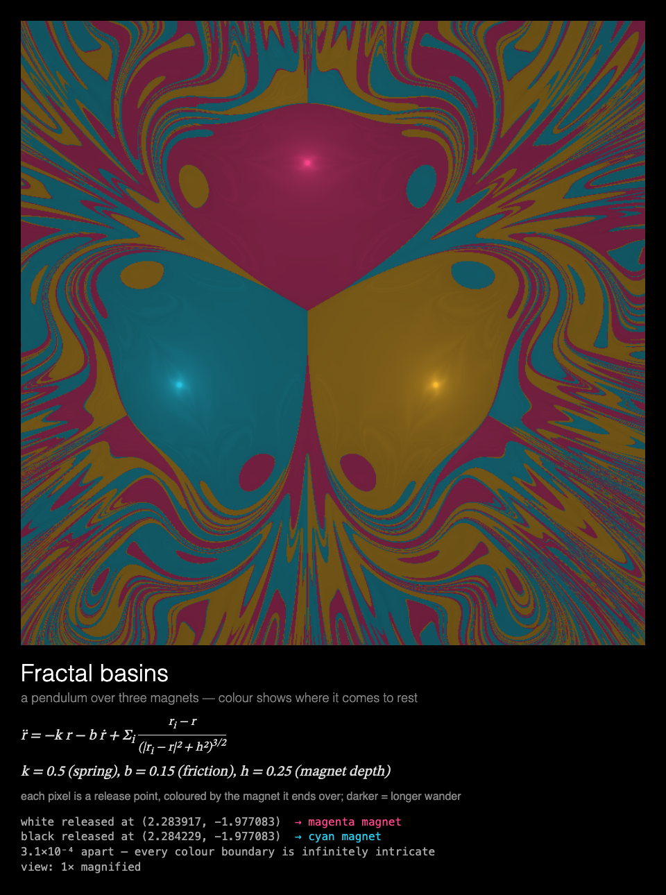

# MMM-ChaosTheory

A [MagicMirror²](https://magicmirror.builders/) module that shows chaos theory in motion: eleven
physically correct simulations, one at a time, each with its equations and live numbers underneath.



| key | what you see |
|---|---|
| `lorenz` | **The Lorenz attractor.** Three trajectories released 10⁻⁵ apart trace the butterfly as one white line, then split into red, green and blue, while the view turns slowly in 3D. |
| `pendulums` | **Sensitive dependence.** Five double pendulums released 10⁻⁶ rad apart swing as one, then fan out, with the angles to 7 decimals and a log-scale plot of their spread (a straight line = exponential divergence). |
| `basins` | **Fractal basins.** A pendulum over three magnets: each pixel is coloured by the magnet it ends over. Two bobs released 3×10⁻⁴ apart swing live and land on different magnets; then the view zooms ×10, ×100, ×1000 into the boundary where they started. |
| `logistic` | **The road to chaos.** The logistic map's bifurcation diagram paints itself, then a cobweb diagram sweeps r through period doubling into chaos, with the period and Lyapunov exponent. |
| `icons` | **Symmetry in chaos.** One point hopping chaotically, millions of times, develops a symmetric picture (Field & Golubitsky). |
| `threeBody` | **The three-body problem**, where Poincaré found chaos in 1889, as a long exposure, with a faint ghost of the same bodies started 10⁻⁶ away. In turn: Burrau's Pythagorean problem (masses 3, 4, 5 released from rest dance, then two pair off and the third is thrown out, for ever), Lagrange's triangle (unstable: the ghost's breaks up after four turns, the real one after eight, from rounding errors alone), and the figure-eight (stable: the ghost stays). |
| `billiards` | **Chaotic billiards.** An elliptical table above Bunimovich's stadium, three balls in each leaving the same point 10⁻⁶ rad apart, as a long exposure: in the ellipse they stay together, one white path fenced in by its caustic; in the stadium they part within a few bounces and go everywhere. |
| `rule30` | **Rule 30.** A row of cells, each new row made from the last by one rule, drawn a row at a time from a single cell: regular on the left, random on the right. The readout keeps the centre column's latest bits and how often it has been 1. |
| `standardMap` | **The standard map.** Chirikov's kicked rotor, orbit by orbit as dots: closed curves and chains of islands where it is regular, grey dust where it is chaotic. Each showing a different kick strength, among them K = 0.9716, where the last barrier from side to side breaks. |
| `waterwheel` | **The chaotic waterwheel.** Malkus's wheel of leaking cups under a spray, turning one way, then the other, never settling; its equations are exactly Lorenz's, and beside it the butterfly they trace, blue while it turns anticlockwise, orange clockwise. |
| `sandpile` | **The sandpile.** Grains dropped on one cell, any cell with four toppling one onto each neighbour: avalanches of every size leave a fractal with the square's exact symmetry. |

A new simulation starts every `cycleSeconds`, and each time the module is shown again.

Each is also a module of its own, to give it a page of its own or show just the ones you like:
[MMM-LorenzAttractor](https://github.com/charleswest775/MMM-LorenzAttractor),
[MMM-DoublePendulum](https://github.com/charleswest775/MMM-DoublePendulum),
[MMM-FractalBasins](https://github.com/charleswest775/MMM-FractalBasins),
[MMM-LogisticMap](https://github.com/charleswest775/MMM-LogisticMap),
[MMM-SymmetricIcons](https://github.com/charleswest775/MMM-SymmetricIcons),
[MMM-ThreeBody](https://github.com/charleswest775/MMM-ThreeBody),
[MMM-ChaoticBilliards](https://github.com/charleswest775/MMM-ChaoticBilliards),
[MMM-Rule30](https://github.com/charleswest775/MMM-Rule30),
[MMM-StandardMap](https://github.com/charleswest775/MMM-StandardMap),
[MMM-ChaoticWaterwheel](https://github.com/charleswest775/MMM-ChaoticWaterwheel) and
[MMM-Sandpile](https://github.com/charleswest775/MMM-Sandpile). This module keeps all eleven in one.

Built for a **Raspberry Pi 3 without GPU acceleration**: everything is drawn by the CPU, so the
drawing is designed around what that costs (see [Performance](#performance)), and the animation
stops completely while the module is hidden.

## Installation

```bash
cd ~/MagicMirror/modules
git clone https://github.com/charleswest775/MMM-ChaosTheory
```

No npm dependencies, so no `npm install`.

## Update

```bash
cd ~/MagicMirror/modules/MMM-ChaosTheory
git pull
```

Up to version 0.4 this module also had the atom, fractal zoom, sacred geometry, sky, planets,
Chladni, tilings, snow and photo pages. Each is now a module of its own (see
[the family](#the-family)): install it, and change `module: "MMM-ChaosTheory"` to its name in
that page's config. Their options are unchanged.

## Configuration

```js
{
	module: "MMM-ChaosTheory",
	position: "middle_center",
	config: {
		simulations: ["lorenz", "pendulums", "basins", "logistic", "icons", "threeBody", "billiards", "rule30",
			"standardMap", "waterwheel", "sandpile"],
		cycleSeconds: 60,
		width: 900,
		height: 900,
		fps: 20
	}
},
```

| Option | Default | Description |
|---|---|---|
| `simulations` | all eleven | Which to show, in order. Also available: `doublePendulum` (the original single pendulum) |
| `cycleSeconds` | `60` | Move to the next simulation this often |
| `width`, `height` | `900` | Canvas size in pixels |
| `fps` | `20` | Frame-rate cap |
| `showMath` | `true` | Equations and live numbers under the canvas |
| `lorenzStyle` | `"rotate"` | `"exposure"`: fixed view, trails build up like a long-exposure photo. About a third of the CPU on a Pi |
| `pendulumStyle` | `"live"` | `"exposure"`: only the bobs' light trails, building up like a long-exposure photo of LED-tipped pendulums. About half the CPU on a Pi |
| `threeBodyScene` | taking turns | `threeBody`: always this one: `"pythagorean"`, `"lagrange"` or `"figure-eight"` |
| `standardMapK` | taking turns | `standardMap`: always this kick strength, e.g. `0.971635` (otherwise 0.5, 0.9716, 1.3 and 2.4 in turn) |
| `sandpileCell` | `4` | `sandpile`: pixels per cell. 3 for finer detail, at three times the toppling (see [Performance](#performance)) |
| `turns` | `null` | Share a page with other modules, taking turns: see [Taking turns](#taking-turns) |
| `statsPanel` | `false` | A line under the math showing what the mirror spends: fps, CPU of Electron and the compositor, a bar per core, temperature, and the simulation cycle. Sampled by the module's `node_helper` from `/proc`, only while the module is shown |
| `debugStats` | `false` | Show achieved fps and per-frame timings in the corner of the screen |

## Taking turns

With [MMM-pages](https://github.com/edward-shen/MMM-pages), a page can hold several modules that
take turns, one per showing, so the rotation doesn't grow with every module. Give each
`turns: { of: n, at: k }`: it shows on showings k, k + n, k + 2n… of its page (counting from 0),
and on the others takes no room and costs nothing. For instance the chaos page and
[MMM-FractalZoom](https://github.com/charleswest775/MMM-FractalZoom) in turn:

```js
{
	module: "MMM-ChaosTheory",
	classes: "page-science",
	position: "middle_center",
	config: { turns: { of: 2, at: 0 } }
},
{
	module: "MMM-FractalZoom",
	classes: "page-science",
	position: "middle_center",
	config: { turns: { of: 2, at: 1 } }
},
```

and `modules: [["page-science"], /* … */]` in MMM-pages' config. Without `turns` the module simply
shows whenever it is shown, on a page of its own or in any region without MMM-pages.

## Performance

Measured on the mirror (Pi 3 B+, Electron 42, software rendering, 900×900 canvas, 20 fps),
as CPU of the Electron processes plus the `cage` compositor over 60 s, in % of one core
(the Pi has four). Baseline mirror without the module: 0.2%.

| | % of one core | achieved fps |
|---|---|---|
| module **hidden** (e.g. another MMM-pages page) | **0.3** | 0 |
| `lorenz` (rotating) | 165 | 16 |
| `pendulums` (live) | 146 | 19 |
| `basins` (average over its sequence; ~7 while a picture is held) | 42 | 20 |
| `logistic` | 73 | 17 |
| `icons` (while developing, ~45 s; then ~7) | 66 | 17 |
| `threeBody`, over a 60 s showing (Burrau's problem and Lagrange's triangle) | 76 | 24 |
| `billiards`, the same | 58 | 22 |
| `rule30`, the same | 28 | 20 |
| `standardMap`, over a 45 s showing (as MMM-StandardMap) | 31 | |
| `waterwheel`, the same (as MMM-ChaoticWaterwheel) | 71 | |
| `sandpile`, the same (as MMM-Sandpile) | 45 | |
| `lorenzStyle: "exposure"` | 55 | 20+ |
| `pendulumStyle: "exposure"` | 66 | 20+ |
| *v0.1.0 single pendulum, 30 fps, for comparison* | *140 + cage* | |

Where a simulation can't reach 20 fps the Pi's renderer is saturated, so its CPU stays near
150% whatever `fps` is set to.

What costs what, from micro-benchmarks on the Pi (`dev/bench.js`):

- Any frame that changes the canvas costs ~2% of a core per fps, before drawing anything.
- On top of that, cost grows with the **area that changes**: Chromium redraws the bounding box
  of everything touched in a frame. Clearing all 900×900 doubles the cost. So the simulations
  draw only what's new (long-exposure trails, incremental plots) and avoid changing distant
  parts of the canvas in the same frame.
- JavaScript is not the bottleneck: step and draw take 0.1–3 ms per frame.
- The frame loop sleeps with `setTimeout` until a frame is due. A simulation showing a finished
  picture rests, and is only polled twice a second. While MagicMirror fades the module out,
  nothing new is drawn.

Of the three newest (measured as modules of their own, the same code, over 45 s pages),
`standardMap` adds a whole orbit (a full-canvas change) only three times a second and rests
after 42 s; `waterwheel`'s frames take turns between the wheel's box and the butterfly's newest
stretch, and it never rests; `sandpile` repaints the pile four times a second, and its toppling,
timed on the Pi, is 3.5 s of CPU over its 42 s at 4 px cells (11.7 s at 3 px).

The fractal basin maps are rendered ahead of time (`node tools/render-basins.js`, ~2 min on
a Mac): at ~3.5 ms per pixel, a Pi 3 would need 47 minutes of CPU for one.

## Development

```bash
node --test                  # physics checks, no dependencies
node dev/serve.js            # then open http://localhost:8765/dev/preview.html
node tools/render-basins.js  # re-render assets/basins-*.png after changing the magnetic pendulum
```

The tests check the physics against known results rather than looks: energy conservation,
the Lorenz fixed points and Lyapunov exponent (≈ 0.906), exponential divergence of the
pendulums, the logistic map's bifurcation points and Feigenbaum ratio, the basins' three-fold
symmetry and convergence under a finer time step, the icons' n-fold symmetry, the three-body
problem's conserved quantities and Burrau's escape, the billiards' reflections, and rule 30's rows.

`dev/preview.html` runs the module outside MagicMirror, in a portrait 1200×1920 frame, with
hide/show buttons that follow MagicMirror's suspend/resume order. Query options override the
config, e.g. `?simulations=threeBody&threeBodyScene=lagrange`. `dev/cpu-trace.py` traces the
mirror's CPU on the Pi, a quarter of a second at a time.

## The family

Besides the eleven chaos simulations on their own (above), pages of physics and mathematics for
the same kind of mirror, each its own module, built the
same way (a frame-capped canvas that rests when the picture is still and stops when hidden) and
able to take turns on a page:

- [MMM-Atom](https://github.com/charleswest775/MMM-Atom): a Bohr-style atom, element by element, and hydrogen's quantum orbitals
- [MMM-DoubleSlit](https://github.com/charleswest775/MMM-DoubleSlit): the double slit one photon at a time, and watched
- [MMM-FractalZoom](https://github.com/charleswest775/MMM-FractalZoom): an infinite zoom into the Mandelbrot set and Julia sets
- [MMM-Chladni](https://github.com/charleswest775/MMM-Chladni): sand on a vibrating plate finds its nodal lines
- [MMM-SacredGeometry](https://github.com/charleswest775/MMM-SacredGeometry): a new compass-and-straightedge figure each time
- [MMM-Tilings](https://github.com/charleswest775/MMM-Tilings): Penrose, hyperbolic and hat tilings, laid tile by tile
- [MMM-PlanetsDance](https://github.com/charleswest775/MMM-PlanetsDance): real orbits from today, drawn as figures
- [MMM-Harmonograph](https://github.com/charleswest775/MMM-Harmonograph): pendulums drawing, a new figure each time
- [MMM-SnowCrystal](https://github.com/charleswest775/MMM-SnowCrystal): a snow crystal grown live
- [MMM-NightSky](https://github.com/charleswest775/MMM-NightSky): the sky over the mirror, tonight
- [MMM-PhotoDeck](https://github.com/charleswest775/MMM-PhotoDeck): your photos, one at a time, crossfading

## License

MIT
